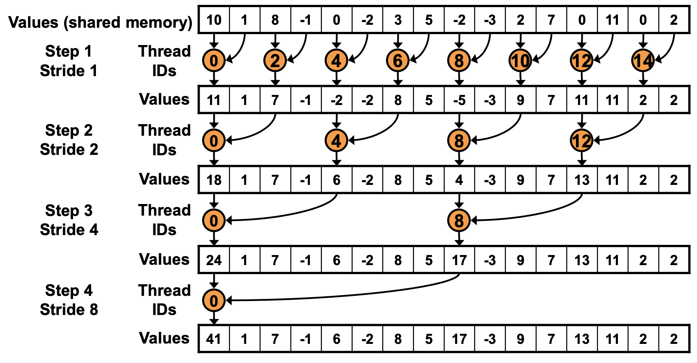
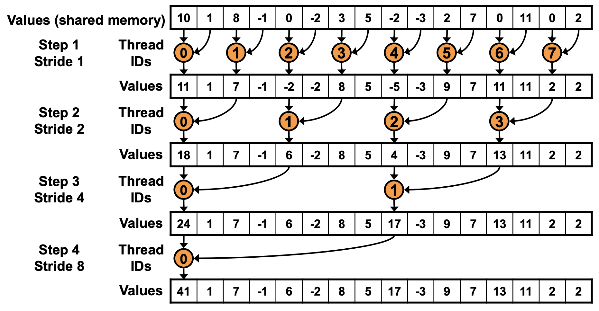
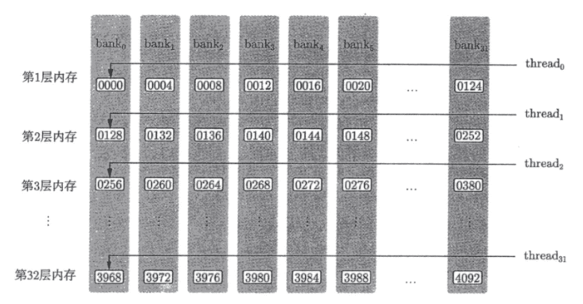

# 算子优化记录

## Reduct

### 朴素实现

```c
for (int s = 1; s < bdim; s *= 2)
{
    if (tid % (2 * s) == 0 && i + s < len)
    {
        sdata[tid] += sdata[tid + s];
    }
    __syncthreads();
}
```

这个是最简单的版本，但是会导致线程束分化：对于同一个 `warp` 内的线程，同一时刻必须执行同一指令。所以在同一 `warp` 中，对于 0 到 31 号线程，只有一半的线程满足 `if` 条件，其余线程需要等待，所以会发生线程束分化。线程分配方式如下图所示：



### 避免线程束分化

我们可以修改线程的分配方式，令同一个 `warp` 中的线程执行相同的指令：



此时代码如下：

```c
for (int s = 1; s < bdim; s *= 2)
{
    int index = 2 * s * tid;
    if ((index + s < bdim) && (bdim * bid + s < len))
    {
        sdata[index] += sdata[index + s];
    }
}
```

### 避免 bank conflict (0.5ms)

对于 `cuda` 的动态共享内存，会被划分为 32 个可被同时访问的 bank。共享内存中连续的 128 字节的内容会被分摊到 32 个 bank 中的同一层中。



- 如果同一个 warp 的多个线程同时访问同一个 bank，那么它们的访问就会被串行化，导致 bank conflict，导致性能降低
- 如果一个线程访问一个 bank 的不同地址，不会被串行化
- 如果多个线程访问同一个 bank 的同一个地址，不会被串行化，会发生广播

所以优化代码的思路：

```c
for(int s = blockDim.x / 2; s > 0; s >>= 1) {
    if (tid < s){
        sdata[tid] += sdata[tid + s];
    }
    __syncthreads();
}
```

避免同一个 warp 内的不同线程访问同一个 bank 的不同地址。

### 减少空闲线程 (0.3ms)

在加载内存的时候，完成一次加法，这样就可以省掉一半的 grid。

### 循环展开 (0.2ms)

由于 `cuda` 是单指令多线程的架构。所以在步长小于 32 的时候，计算会发生在同一个 warp 内，不在需要 `__syncthreads` 同步。

### 参考

晚上下班时间少写的有点精简，具体的优化思路可以参考这里：https://github.com/PaddleJitLab/CUDATutorial/tree/develop/docs/09_optimize_reduce

## GEMM

矩阵类型为 float，大小如下：

```c
Matrix src1{ElemType::ElemFloat, {2048, 1024, 1}, MemoryType::GlobalMemory, IsAsync::IsAsyncFalse};
Matrix src2{ElemType::ElemFloat, {1024, 2048, 1}, MemoryType::GlobalMemory, IsAsync::IsAsyncFalse};
```

C 实现为 640 ms。

### 朴素实现 (5.2 ms)

```c
template <typename T>
__global__ void GemmKernel(T *src1, T *src2, T *dst, std::size_t h, std::size_t k, std::size_t w) {
    const int tx = threadIdx.x;
    const int ty = threadIdx.y;

    const int height = blockIdx.y * blockDim.y + ty;
    const int width = blockIdx.x * blockDim.x + tx;

    if (width >= w || height >= h) {
        return;
    }

    float sum = 0.0f;

    for (int i = 0; i < k; i++) {
        sum += src1[height * k + i] * src2[w * i + width];
    }

    dst[height * w + width] = sum;
}
```

### 共享内存 (3.7 ms)

一般来说，使用共享内存后总的内存访问次数会减少，特别是对全局内存的访问次数会显著减少。共享内存缓存了一部分数据，使得多个线程可以重复使用这些缓存的数据，而不需要每次都从全局内存重新加载，我不太清楚你是如何推出他们访问全局内存的次数是一样的

矩阵乘法（GEMM）中，计算过程中对每个数据块（如A矩阵的一行或B矩阵的一列）会多次访问。如果直接从全局内存读取，每次使用这些数据都需要重新从全局内存中加载。使用共享内存后，这些数据被加载到共享内存中，之后可以在共享内存中被多个线程重复使用，从而减少对全局内存的访问。

假设 src1[M, K], src2[K, N]。

- 错误版本：如果计算得到 [M, N] 的矩阵，对于 dst 矩阵的每个点，都需要读 src1 的一行和 src2 的一列，所以不管是否使用共享内存优化， IO 量是一样的。

- 正确版本，根据 kernel 函数算 IO 次数，乘以 block 的大小，在乘以每个 block 内线程的数量，动态内存的访问忽略不记的话，的确比朴素实现的 IO 少很多。

### 一维优化 (1.3 ms)

### 二维优化 (0.9 ms)

### 向量化访存 (0.7 ms)

### warp 展开

### 双缓冲 (0.62 ms)

没快多少

# conv

参数：

```c
const int batch_size = 2;
const int src_height = 130;
const int src_width = 514;
const int src_channel = 12;

const int kernel_channel = 24;
const int kernel_height = 3;
const int kernel_width = 3;
const int h_stride = 1;
const int w_stride = 1;
```

## 朴素实现 (1.2ms)

## img2col + 隐 GEMM (0.6ms)