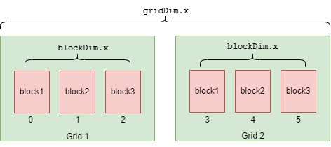
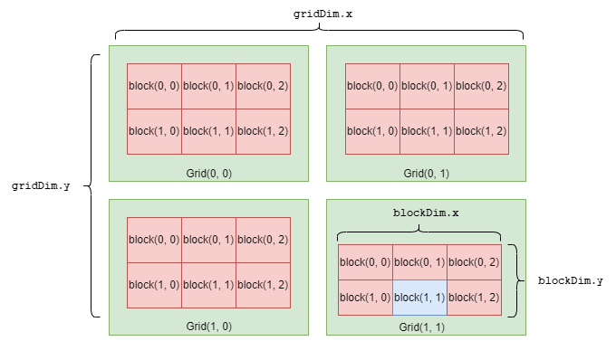

# 线程模型

如果说 cuda 可以分为三大模块：线程模型、内存模型、计算架构，这真的是很重要的一部分...不过在这里只介绍线程的索引方式，这个和计算元素在数组中的索引没啥区别，无非是一维数组，二维数组，三维数组这样。线程束的问题留到后面。

## 一维

还记得 helloworld 章节有一行代码：

```c
hello_from_gpu<<<1, 1>>>();
```

除了那三个尖括号外，其余内容和 `C` 代码没有任何区别：调用一个名字叫 `hello_from_gpu` 的无参函数。

而那三个尖括号中，第一个参数表示 grid 的大小，第二个参数表示 block 的大小，对于 `hello_from_gpu<<<2, 3>>>()` 我们直接上图：

<p align="center">
  
</p>

在上图中，水平方向有两个 grid，每个 grid 里面有三个 block。我在下面编了号，那么如何找到编号为 4 的线程，让他执行点别的函数呢？

像计算矩阵索引一样：

由 block 的索引 `blockIdx.x`（取值为1），乘以 block 的宽度 `blockDim.x` （取值为 3），在加上编号为 4 的线程在第二个 grid 中的索引 `threadIdx.x` 即可。有一个小规律：

- 看到 `gridIdx, blockIdx, threadIdx` 是在求索引，不同线程的取值会发生变化
- 看到 `gridDim, blockDim` 是在求 grid 或者 block 的维度，这个是固定的取值，由那三个尖括号传入

```c
__global__ void func_1d() {
    const int block_id  = blockIdx.x;
    const int thread_id = threadIdx.x;
    const int block_dim = blockDim.x;

    if (4 == block_id * block_dim + thread_id) {
        printf("Hello GPU \n");
    } else {
        printf("Not Hello GPU \n");
    }
    return;
}

printf("========== 1D ========== \n");
dim3 grid_size_1d(2);
dim3 block_size_1d(3);
func_1d<<<grid_size_1d, block_size_1d>>>();
cudaDeviceSynchronize();
```

最终，只有一个线程打印了 `Hello GPU`，其余线程打印的是 `Not Hello GPU`，输出如下：

```
========== 1D ========== 
Hello GPU 
Not Hello GPU 
Not Hello GPU 
Not Hello GPU 
Not Hello GPU 
Not Hello GPU 
```

## 二维

~~加快点进度，太晚了影响我睡觉，第二天还上班~~

相比于一维，这里增加了 `y` 轴的维度，我们来计算蓝色线程的索引号。

<p align="center">
  
</p>

首先计算水平方向有几个 grid，上图中的取值是 2

```c
const int grid_dim_x       = gridDim.x;
```

之后计算这个蓝色线程位于哪个 block，管它叫 [特殊 block] 吧。blockIdx.y 和 blockIdx.x 取值均为 1，所以 [特殊 block] 为 3

```c
const int block_id         = blockIdx.y * grid_dim_x + blockIdx.x;
```

之后计算蓝色线程在 [特殊 block] 中的索引，看看蓝色线程在当前 [特殊 block] 中排第几个。threadIdx.x 和 threadIdx.y 取值均为1，上图中每个 grid 水平方向有 3 个 block blockDim.x 的取值为 3。所以 thread_local_id 为 4。

```c
const int thread_local_id  = threadIdx.x + threadIdx.y * blockDim.x;
```

计算在 [特殊 block] 之前一共有多少个线程，也就是 block_id * blockDim.x * blockDim.y 么多个。在加上 thread_local_id，就是蓝色线程的索引号了，为 22。

```c
const int thread_id        = thread_local_id + block_id * blockDim.x * blockDim.y;
```

最终代码：

```c
__global__ void func_2d() {
    const int grid_dim_x       = gridDim.x;
    const int block_id         = blockIdx.y * grid_dim_x + blockIdx.x;
    const int thread_local_id  = threadIdx.x + threadIdx.y * blockDim.x;
    const int thread_id        = thread_local_id + block_id * blockDim.x * blockDim.y;

    printf("Thread id is %d \n", thread_id);
    return;
}

dim3 grid_size_2d(2, 2);
dim3 block_size_2d(2, 3);
func_2d<<<grid_size_2d, block_size_2d>>>();
cudaDeviceSynchronize();
```

在这里，`dim3` 是 cuda 的内置数据类型，可以创建 3 维数组。其实我们都可以脑补出 `dim3` 的大概写法：

```cpp
class dim3 {
public:
    int x;
    int y;
    int z;
    dim3(int _x, int _y, int _z) : x{_x}, y{_y}, z{_z} {}; 
};
```

## 三维

~~不想画图了~~。相比于二维，这里增加了 `z` 轴的维度，其余都是一样的：

```c
__global__ void func_3d() {
    const int block_id        = blockIdx.z * gridDim.x * gridDim.y + blockIdx.y * gridDim.x + blockIdx.x;
    const int thread_local_id = threadIdx.z * blockDim.x * blockDim.y + threadIdx.y * blockDim.x + threadIdx.x;
    const int thread_id = thread_local_id + block_id * blockDim.x * blockDim.y * blockDim.z;

    printf("Thread id is %d \n", thread_id);
    return;
}

dim3 grid_size_3d(2, 1, 2);
dim3 block_size_3d(1, 1, 3);
func_3d<<<grid_size_3d, block_size_3d>>>();
```

除此之外，还有二维 grid 三维 block，一维 grid 三维 block，三维 grid 一维 block 的任意排列组合。~~具体用法等我遇到了再来填坑~~
