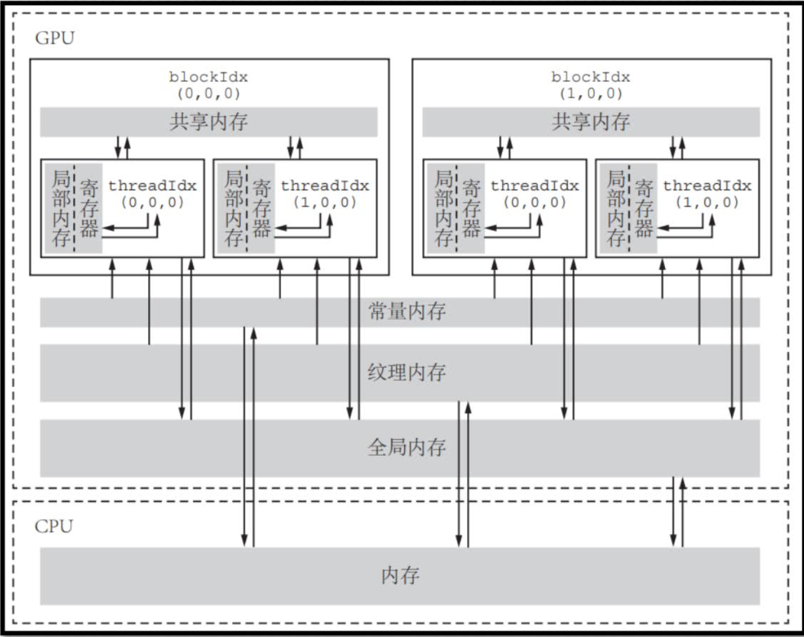
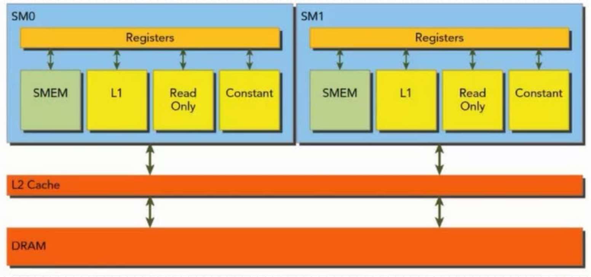

# 内存模型

学过操作系统的我们都知道，寄存器的访问速度大于内存，内存的访问速度大于磁盘。而对数据的读取和写出很大程度影响了程序的性能。写程序时，会尽可能降低 IO 带来的影响。

在 cuda 中也不例外，cuda 中的内存结构如下所示，每种内存都有自己的作用域、访问权限和空间大小。和操作系统一样，访问速度越快的内存，容量也就越小。

<p align="center">
  
</p>

## 全局内存

### 动态全局内存

> 在之前的矩阵加法程序中，将 CPU 侧的内存通过 `cudaMemcpy` 函数拷贝到 GPU 的全局内存中，任意 grid 中的任意 block 中的任意线程可读取和写入，由 CPU 侧完成申请和释放。访问速度也是最低的。

```c
template <typename T>
__global__ void MatrixGPUAdd(T *src1, T *src2, T *dst, const int size) {
    ...
    dst[idx] = src1[idx] + src2[idx];
}
```

在这个 kernel 函数中，`T* src1, T*src2, T* dst` 就是接受的全局内存。可以通过下面的 API 得到全局缓存的大小

```c
cudaDeviceProp prop;
cudaGetDeviceProperties(&prop, i_device);
printf(" device name          \t %s\n", prop.name);
printf(" device global mem    \t %lu MB\n", prop.totalGlobalMem / 1024 / 1024);
```

我主机的全局内存为 12281 MB。

### 静态全局内存

使用 `__device__` 声明，且大小需要能在编译时期确定，且不能定义在 GPU 和 CPU 的函数之中，需要定义在外部：

```c
#define NUM 10
__device__ int bias[NUM];
```

且无需传参，可以在 kernel 函数中直接访问：

```c
__global__ void Func() {
    const int thread_idx = blockIdx.x * blockDim.x + threadIdx.x;
    bias[thread_idx] += 1;
}
```

同样的，CPU 侧代码不能直接访问静态全局内存，需要使用 `cudaMemcpyToSymbol` 将 CPU 的内存拷贝到 GPU 的全局静态内存，使用 `cudaMemcpyFromSymbol` 将 GPU 的全局静态内存拷贝回 CPU 侧：

```c
int arr[NUM];
for (int i = 0; i < NUM; i++) { arr[i] = i - 1; }         // CPU 赋值

ret = cudaMemcpyToSymbol(bias, arr, sizeof(int) * NUM);   // CPU -> GPU
ErrorHandleWithLabel(ret, EXIT);

Func<<<global_size, local_size>>>();                      // 启动核函数
ret = cudaDeviceSynchronize();
ErrorHandleWithLabel(ret, EXIT);

ret = cudaMemcpyFromSymbol(arr, bias, sizeof(int) * NUM); // GPU -> CPU
ErrorHandleWithLabel(ret, EXIT);

for (int i = 0; i < NUM; i++) { printf("arr[%d] = %d\n", i, arr[i]); }  // 查看结果
```

从这部分代码开始，全部使用 `cmake` 管理和构建程序。cmake 可以看看我之前写的[CMakeGuide教程](https://github.com/muyuuuu/CMakeGuide)。

对本节的 cmake 进行补充说明：

```cmake
set(CMAKE_INSTALL_PREFIX "${CMAKE_BINARY_DIR}")
install(TARGETS MEM RUNTIME DESTINATION bin)
```

- `TARGETS`：这个参数后面跟着的是你想要安装的目标的名称。在这个例子中，`MEM` 是一个目标名称，它可能是一个可执行文件、库文件等。
- `MEM`：这是你想要安装的构建目标的名称。
- `RUNTIME`：这个参数指定了你想要安装的目标的类型。`RUNTIME` 通常用于可执行文件，表示在运行时需要的文件。CMake 还支持其他类型，如 LIBRARY 用于库文件，ARCHIVE 用于归档文件（如静态库）等。
- `DESTINATION bin`：这个参数指定了安装目标的目的地。在这个例子中，`DESTINATION` 后面跟着的是 `bin`，意味着 `MEM` 这个构建目标（假设是一个可执行文件）将被安装到 `CMAKE_INSTALL_PREFIX/bin` 目录下。

## 寄存器和局部内存

> 每个线程也有自己的局部内存和寄存器（32 位），只能被自己读取，其他线程无法访问，用于存放一些临时变量等。

```c
template <typename T>
__global__ void MatrixGPUAdd(T *src1, T *src2, T *dst, const int size) {
    const int block_id = blockIdx.x;
    const int tid = threadIdx.x;
    const int idx = tid + block_id * blockDim.x;
    if (idx >= size) { return; }

    dst[idx] = src1[idx] + src2[idx];
}
```

在这段代码中，没有添加任何限制符（`__global__` 就是限制符）的 `block_id, tid, idx` 就位于寄存器中，此外一些内建变量如 ` blockIdx.x, threadIdx.x` 也放在寄存器中。可以通过下面的 API 来获取每个 block 可用的寄存器的大小：

```c
// 每个 block 可用 64K 这么多寄存器，每个寄存器 32 bit
printf(" device register number in block \t %d  KB\n", prop.regsPerBlock / 1024);  
// 每个 SM 可用 64K 这么多寄存器，每个寄存器 32 bit
printf(" device register number in sm    \t %d  KB\n", prop.regsPerMultiprocessor / 1024);
```

当寄存器不够用时，会放到局部内存（每个线程可用 512KB 的局部内存）中，也就是寄存器溢出。以下几种情况可能会发生寄存器溢出：

- 索引值在编译时无法确定
- 可能占用大量寄存器空间的数组。如多个 block 并行执行时，每个线程都在申请自己的内存
- 单个线程所需的寄存器数量超过了 255 个

编译 `4runtime` 中的程序，添加 `--resource-usage` 编译选项，可以看到使用了 8 个寄存器，和 348 字节的常量内存。

```c
ptxas info    : Used 8 registers, 348 bytes cmem[0]
```

## 共享内存

> 每个线程块有自己的共享内存，所有线程共享，完成数据共享或者交换。频繁访问且占用空间较小的数据、线程块内部可以共享的数据建议放到这里。

使用 `__shared__` 修饰的变量是共享内存，和全局内存一样，分为动态共享内存和静态共享内存。每个流多处理器共享内存数量是一定的。如果线程块分配过度的共享内存，其他线程的资源会受到限制，那么会限制活跃的线程的数量。可以通过以下 API 查询线程块和流多处理器所允许的共享内存的大小：

```c
printf("Maximum amount of shared memory per block: %g KB\n", prop.sharedMemPerBlock / 1024.0);            // 48 KB
printf("Maximum amount of shared memory per SM:    %g KB\n", prop.sharedMemPerMultiprocessor / 1024.0);   // 100 KB
```

单个线程块最大允许使用 99KB 的共享内存，如果一个线程块需要使用的共享内存超过了 99KB，会导致核函数无法启动。

### 静态共享内存

- 和全局静态内存相同，在编译时期就得确定大小
- 如果声明在核函数中，作用域在核函数内；声明在文件中，全部核函数共享。

在下面的函数中，使用 `__shared__` 修饰符创建静态共享内存，并从全局静态内存中读取数据，并调用 `__syncthreads` 函数等待 block 内的所有线程都执行到这里，并使用最后一个线程打印数组的值。

```c
__global__ void SharedStaticMemFunc() {
    const int thread_idx = blockIdx.x * blockDim.x + threadIdx.x;
    if (thread_idx >= NUM) { return; }

    __shared__ int static_array[NUM];
    if (thread_idx < NUM) { static_array[thread_idx] = bias[thread_idx]; }

    __syncthreads();

    if (NUM - 1 == thread_idx) {
        printf(" ==== Shared Static Mem Tets ==== \n");
        for (int i = 0; i < NUM; i++) { printf("arr[%d] = %d\n", i, static_array[i]); }
    }
}
```

### 动态共享内存

在所有函数外部使用关键字 `extern __shared__` 创建动态共享内存，并且不指定大小：

```c
extern __shared__ int dynamic_array[];
```

在调用时指定大小：

```c
DynamicStaticMemFunc<<<global_size, local_size, NUM>>>();
```

## 常量内存

> 常量内存，大小只有 64K，任意 grid 中的任意 block 中的任意线程可读取，GPU 侧不能写入。但 CPU 侧可以写入，由 CPU 侧完成申请和释放。

常量内存使用 `__constant__` 修饰。和全局静态内存一样，必须定义在函数外部。当所有线程都需要从相同地址读取数据时，静态内存表现最好，常见于数学公式的系数。只需要读取一次，广播给线程束中的所有线程即可。

```c
__constant__ int c_val_0;        // 未初始化
__constant__ int c_val_1 = 3;    // 初始化
```

对于未初始化的静态变量，需要在 CPU 侧使用 `cudaMemcpyToSymbol` API 对其赋值：

```c
int val = 7;
ret = cudaMemcpyToSymbol(c_val_0, &val, sizeof(int));
```

## GPU 缓存

> 这部分内存不可编程。每个流多处理器有一个一级缓存，所有流多处理器共享一个二级缓存。

<p align="center">
  
</p>

和操作系统一样，加载内存上的变量需要经过 L2 缓存，是否经过 L1 缓存可以通过编译选项设置。但是写出数据时不会经过缓存。

统一数据缓存大小为 128KB，包括共享内存、纹理内存和 L1 缓存：

- 共享内存时可编程的，可以设置大小为 0，8，16，32，64 或者 100KB，其余用作 L1 缓存和纹理内存。但是不一定生效，GPU 会选择最优的设置。

## 统一内存

> 不是显存也不是内存，而是 CPU 和 GPU 可以访问且保持一致性的虚拟存储器。统一内存则能将数据放在一个合适的位置上(可以使主机，也可以是设备)

- 不需要将主机内存拷贝到设备，而是主机端调用 `cudaMallocManaged` 创建，主机和设备直接读写。简化编程
- 允许 GPU 在使用了统一内存的情况下，进行超量分配。超出 GPU 额度的部分放在主机上，这可能是使用统一内存时最大的好处，因为一般来说，CPU 的内存更多，但处理速度较低
-底层的统一内存实现，会自动将一部分数据放置在距离某个存储器更近的位置(如部分放置在某卡的显存中，部分放置到内存中)这种就近的数据存放，有利于提升性能

代码如下所示：

```c
double* x;
cudaMallocManaged((void**)&x, M);
cudaFree(x);
```

统一内存也可以静态分配，只要在修饰符的 `__device__` 的基础上再加上修饰符 `__managed__` 即可。和全局内存相比，性能如下所示（代码为u与 `func.ch`）：

```c
 In Epoch 1, Host Memory Cost 0.0164 ms 
 In Epoch 2, Host Memory Cost 0.0073 ms 
 In Epoch 3, Host Memory Cost 0.0072 ms 
 cudaMemcpy Cost 0.6000 ms 
 In Epoch 1, Unify Memory Cost 0.0819 ms 
 In Epoch 2, Unify Memory Cost 0.0819 ms 
 In Epoch 3, Unify Memory Cost 0.0813 ms 
```

如果不考虑 `cudaMemcpy`，那么传统内存最快；当数据量较大时，`cudaMallocManaged` 会更快，因为 `cudaMemcpy` 较大。