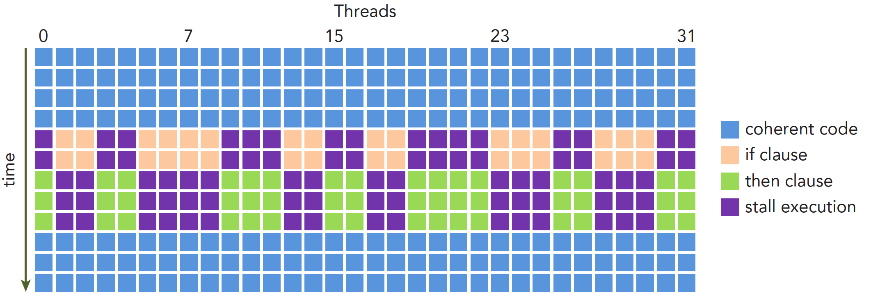

# 计算架构

## 流多处理器

一个 GPU 由多个流多处理器 SM(stream multiprocessor) 组成：

<p align="center">
  
</p>

- 每个 SM 包含多个 cuda core，cuda core 包括一些整型、浮点的计算单元
- SM 还包括共享内存和 L1 缓存

重要的是 warps 线程调度单元，每个 SM 包括两个线程束调度器和两个指令调度单元。

## 线程束

当线程块指定给一个 SM 时（多个线程块可以被分到同一个 SM），线程块内的所有线程会被分为线程束：32 个线程为一组视为一个线程束，这里需要注意的是，线程束中只能是同一个线程块之间的线程，不能跨线程块组队。

<p align="center">
  
</p>

cuda 执行指令是单指令多线程的方式，在同一时刻只能执行一个线程束，所以并行执行的是线程束中的 32 个线程，不同线程块之间是并发执行的。

但是，还记得在第 5 部分提到的，如果线程块占用的寄存器、共享内存很大，而每个 SM 的寄存器、共享内存的资源是有限的，毕竟一个线程用完了其他线程就没得用了。所以同时存在于一个 SM 中的线程束的数量还取决于 kernel 函数所需寄存器、共享内存的资源。

## SM 占有率

使用以下 API 查询一个 SM 允许主流多少的线程和线程块：

```c
printf(" Max threads per    SM:  %d\n", prop.maxThreadsPerMultiProcessor);  // 1536
printf(" Max blocks  per    SM:  %d\n", prop.maxBlocksPerMultiProcessor);   // 24
```

提高程序的并行性，就是让每个 SM 上驻留的线程数更加接近 1536，以及合理的调整线程块的大小，让线程块的数量（Grid）也接近 24，使 SM 的占用率最高。

当计算资源分配给线程块时，这个线程块是活跃的线程块，包含的线程束是活跃的线程束。占用率的计算为：活跃线程束数量 / 最大线程束数量。

当线程数足够多时：

- 寄存器和共享内存使用很少的情况，线程块中的线程数（Block）不小于 64 时（64 * 24 = 1536），可以获得 100% 的占有率
- 当在 SM 上驻留最多的线程 1536 个，核函数中每个线程最多使用 42 个寄存器（42 * 1536 > 64K ）
- 若线程块大小定义为 64，每个 SM 需要激活 24 个线程块才能拥有 1536 个线程，达到 100% 的利用率，每个线程块可分配 4.16KB 的共享内存。（100 K / 24）

所以为了提升 SM 占用率：

- 保持每个线程块中线程数量（Block）是线程束大小的倍数，如果线程数量是 65，那么最后一个线程束只有一个线程
- 线程块（Grid）不要设计的太小
- 线程块的数量要远远大于 SM 的数量，对指令和内存的操作进行延时隐藏

## 延迟隐藏

寻思没啥可说的，理论方面，掏出计算机组成原理中的多级流水图，和这个同一个意思，指令足够多的时候，用计算的指令与隐藏 IO 的指令。

<p align="center">
  
</p>

代码方面，可以看我之前写的代码：[任务流水：加快程序运行和减少内存占用我全都要
](https://muyuuuu.github.io/2024/05/07/multi-pipeline/)。

## 避免线程束分化

线程束中的所有线程同一时刻必须执行相同的指令。但是如果代码写的很差，比如由很多的 if else  分支，由于 GPU 没有负责的分支预测机制，这会导致每个线程执行不同的指令，并行性就会受到影响。如下所示的图和代码：

<p align="center">
  
</p>

```c
__global__ void mathKernel1(float *c)
{
    int tid = blockIdx.x* blockDim.x + threadIdx.x;
 
    float a = 0.0;
    float b = 0.0;
    if (tid % 2 == 0)
    {
        a = 100.0f;
    }
    else
    {
        b = 200.0f;
    }
    c[tid] = a + b;
}
```

橙色表示满足 if 分支的线程，绿色表示满足 else 分支的线程，紫色表示线程被阻塞。因为不满足条件的线程在等待，线程束分化就会导致同一线程束内的线程不能同时活跃，所以为了获取最佳性能，避免同一线程束中的线程有不同的执行路径。

代码修改如下：

```c
__global__ void mathKernel1(float *c)
{
    int tid = blockIdx.x* blockDim.x + threadIdx.x;
 
    float a = 0.0;
    float b = 0.0;
    if ((tid / 32) % 2 == 0)  // 修改这里
    {
        a = 100.0f;
    }
    else
    {
        b = 200.0f;
    }
    c[tid] = a + b;
}
```